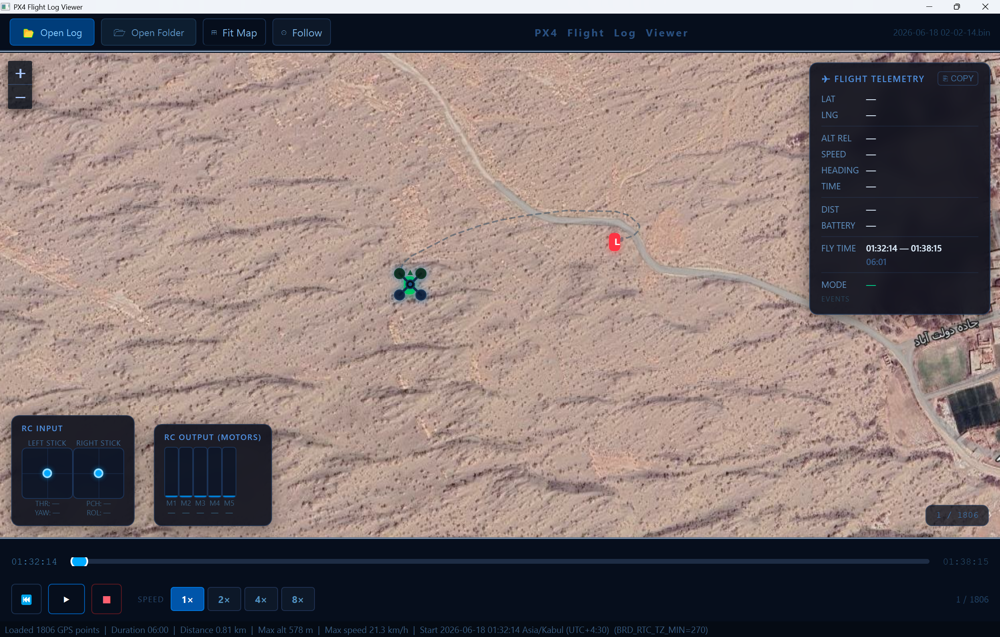
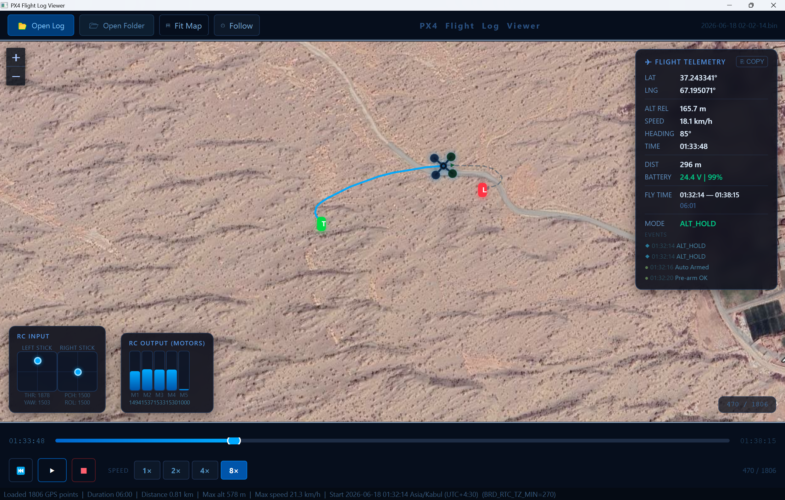

# PX4 Flight Log Viewer

ArduPilot `.bin` log fayllarini vizual ravishda qayta ko'rsatish (simulyatsiya) uchun mo'ljallangan desktop ilova.  
A desktop application for visually replaying ArduPilot `.bin` flight log files.

---

## Screenshots

**Log yuklangandan keyin / Log loaded**



**Qayta ko'rsatish jarayonida / During playback**



---

## O'zbek tili

### Umumiy izoh

PX4 Flight Log Viewer — ArduPilot bortidan olingan `.bin` formatidagi parvoz jurnallarini interaktiv tarzda qayta ko'rsatuvchi dastur. Dastur Google Satellite xaritasi ustida dronning parvoz yo'lini chizib, har bir kadr uchun telemetriya ma'lumotlarini real vaqt rejimida ko'rsatadi.

### Imkoniyatlari

| Xususiyat | Tavsif |
|-----------|--------|
| **Xarita** | Google Hybrid satellite ko'rinishi (Leaflet.js) |
| **Parvoz yo'li** | To'liq traektoriya chiziq sifatida ko'rsatiladi |
| **Dron belgisi** | Quadrotor (X-konfiguratsiya) SVG belgisi, yo'nalish ko'rsatkichi bilan |
| **Telemetriya paneli** | LAT · LNG · ALT REL · TEZLIK · YO'NALISH · VAQT |
| **Batareya** | Kuchlanish (Volt) va qolgan quvvat (%) rangli indikator bilan |
| **3D tezlik** | Gorizontal + vertikal tezlik birlikda `√(V²_2d + V²_vert)` |
| **3D masofa** | Haversine + balandlik farqi asosida kumulyativ uchish masofasi |
| **Vaqt zonasi** | Koordinatalar bo'yicha avtomatik aniqlanadi (Kabul UTC+4:30 va boshqalar) |
| **Hodisalar ro'yxati** | Parvoz rejimi o'zgarishlari, Arm/Disarm, Takeoff/Landing, GPS yo'qolishi, RC aloqa uzilishi |
| **Follow rejimi** | Dronni doim xarita markazida ushlab turadi; xaritani siljitganda o'chadi |
| **Papka paneli** | Papkani ochib `.bin` fayllar ro'yxatini ko'rsatadi; bitta bosish bilan yuklaydi |
| **Playback boshqaruvi** | Play · Pause · Stop · 1× · 2× · 4× · 8× tezlik |
| **Fit/Center** | Barcha yo'lni ekranga sig'dirish yoki dron ustida markazlash |
| **RC Input** | Joystick kanallarini vizual ko'rsatish |
| **RC Output** | Motor signal kuchini bar diagrammasi sifatida ko'rsatish |
| **Status bar** | Masofa · Maksimal balandlik · Maksimal tezlik |

### Windows tizimida ishga tushurish

#### Talab qilinadigan dasturlar
- Python 3.10 yoki undan yuqori
- pip

#### O'rnatish

```powershell
# Loyiha papkasiga kirish
cd "C:\path\to\PX4-Log-Viewer"

# Virtual muhit yaratish
python -m venv .venv
.venv\Scripts\activate

# Kutubxonalarni o'rnatish
pip install -r requirements.txt
```

#### Ishga tushurish

```powershell
.venv\Scripts\activate
python main.py
```

#### EXE fayl sifatida build qilish (ixtiyoriy)

```powershell
# PyInstaller o'rnatilgan bo'lishi kerak
pip install pyinstaller

# Build
python -m PyInstaller px4_viewer.spec --clean --noconfirm --distpath "C:\Build"

# Tayyor EXE fayl joylashuvi:
# C:\Build\PX4-FlightViewer\PX4-FlightViewer.exe
```

> **Eslatma:** Windows AppControl siyosati OneDrive papkasidan ishga tushirishni bloklashi mumkin. EXE faylni `C:\Build` kabi mahalliy papkaga build qiling va Explorer orqali oching.

### Linux tizimida ishga tushurish

#### Talab qilinadigan dasturlar

```bash
# Debian/Ubuntu
sudo apt update
sudo apt install python3 python3-pip python3-venv \
     libglib2.0-0 libgl1-mesa-glx libxcb-xinerama0 \
     libxkbcommon-x11-0 libxcb-icccm4 libxcb-image0 \
     libxcb-keysyms1 libxcb-randr0 libxcb-render-util0 \
     libxcb-xkb1
```

#### O'rnatish

```bash
cd /path/to/PX4-Log-Viewer
python3 -m venv .venv
source .venv/bin/activate
pip install -r requirements.txt
```

#### Ishga tushurish

```bash
source .venv/bin/activate
python main.py
```

> **Eslatma:** Linux'da `PyQtWebEngine` paketini pip orqali o'rnatish qiyin bo'lishi mumkin. Muammo chiqsa `python3-pyqt5.qtwebengine` paketini tizim paket menejeridan o'rnating va `requirements.txt` dan `PyQtWebEngine` qatorini olib tashlang.

---

## English

### Overview

PX4 Flight Log Viewer is a desktop application for interactively replaying ArduPilot `.bin` flight logs. It draws the drone's flight path on a Google Satellite map and displays real-time telemetry for each frame of the recording.

### Features

| Feature | Description |
|---------|-------------|
| **Map** | Google Hybrid satellite view (Leaflet.js) |
| **Flight path** | Full trajectory drawn as a polyline |
| **Drone icon** | Quadrotor SVG marker (X-config) with heading arrow |
| **Telemetry panel** | LAT · LNG · ALT REL · SPEED · HEADING · TIME |
| **Battery** | Voltage (V) and remaining charge (%) with color-coded indicator |
| **3D speed** | Horizontal + vertical combined `√(V²_2d + V²_vert)` |
| **3D distance** | Cumulative flight distance via Haversine + altitude delta |
| **Timezone** | Auto-detected from GPS coordinates (e.g. Kabul UTC+4:30) |
| **Events list** | Flight mode changes, Arm/Disarm, Takeoff/Landing, GPS lost/restored, RC failsafe |
| **Follow mode** | Keeps drone centered on map; disabled when the user drags the map |
| **Folder panel** | Browse a folder and see only `.bin` files; single-click to load |
| **Playback controls** | Play · Pause · Stop · 1× · 2× · 4× · 8× speed |
| **Fit / Center** | Fit entire path in view or center on the drone |
| **RC Input** | Visual joystick channel bars |
| **RC Output** | Motor PWM signal bars |
| **Status bar** | Total distance · Max altitude · Max speed |

### Running on Windows

#### Prerequisites
- Python 3.10 or higher
- pip

#### Installation

```powershell
cd "C:\path\to\PX4-Log-Viewer"

python -m venv .venv
.venv\Scripts\activate

pip install -r requirements.txt
```

#### Run

```powershell
.venv\Scripts\activate
python main.py
```

#### Build a standalone EXE (optional)

```powershell
pip install pyinstaller

python -m PyInstaller px4_viewer.spec --clean --noconfirm --distpath "C:\Build"

# Output:
# C:\Build\PX4-FlightViewer\PX4-FlightViewer.exe
```

> **Note:** Windows AppControl may block execution from OneDrive paths. Build to a local path like `C:\Build` and launch the EXE from Explorer, not PowerShell.

### Running on Linux

#### Prerequisites

```bash
# Debian/Ubuntu
sudo apt update
sudo apt install python3 python3-pip python3-venv \
     libglib2.0-0 libgl1-mesa-glx libxcb-xinerama0 \
     libxkbcommon-x11-0 libxcb-icccm4 libxcb-image0 \
     libxcb-keysyms1 libxcb-randr0 libxcb-render-util0 \
     libxcb-xkb1
```

#### Installation

```bash
cd /path/to/PX4-Log-Viewer
python3 -m venv .venv
source .venv/bin/activate
pip install -r requirements.txt
```

#### Run

```bash
source .venv/bin/activate
python main.py
```

> **Note:** On Linux, installing `PyQtWebEngine` via pip can be unreliable. If you encounter issues, install `python3-pyqt5.qtwebengine` from your system package manager and remove `PyQtWebEngine` from `requirements.txt`.

---

## Kutubxonalar / Dependencies

| Paket | Versiya | Maqsad |
|-------|---------|--------|
| PyQt5 | 5.15+ | GUI framework |
| PyQtWebEngine | 5.15+ | Leaflet map (Chromium WebView) |
| pymavlink | 2.4+ | ArduPilot `.bin` log parser |
| timezonefinder | 8.x | GPS → timezone detection |
| tzdata | latest | IANA timezone database |
| numpy | latest | Required by timezonefinder |

---

## Litsenziya / License

MIT
